# Automated GitHub Deployment & Live Sync Guide

This portal is architected to be **100% self-maintaining**. When deployed to GitHub Pages, you **do NOT** need to manually edit files every time a new research paper is published. A built-in GitHub Actions automation handles discovery, summarization, rebuilding, and deployment automatically.

---

## 🚀 How the Automated Updating Pipeline Works

```mermaid
flowchart LR
    Schedule["GitHub Cron Schedule (Every Monday 00:00 UTC)"] --> Runner["GitHub Actions Runner"]
    Runner --> Fetch["fetch_latest_papers.py"]
    Fetch --> HF_API["Hugging Face Daily Papers API & arXiv"]
    HF_API --> Filter["Filter Breakthroughs & Deduplicate"]
    Filter --> Update["Update papers_data.py"]
    Update --> Build["Run generate_all.py"]
    Build --> Commit["Git Commit & Push to main"]
    Commit --> Pages["GitHub Pages Auto-Deploys Live Website!"]
```



1. **Automated Trigger**: Every Monday (or any schedule you choose), GitHub Actions runs in the cloud.
2. **Trending Paper Ingestion**: The script queries the **Hugging Face Daily Papers API** and **arXiv API** for the highest-upvoted seminal papers published in the last 7 days.
3. **Deduplication & Formatting**: Filters out existing papers and formats new entries into our structured schema (*Problem*, *Breakthrough*, *Formula*, *Impact*).
4. **Site Rebuild**: Executes `python generate_all.py` to regenerate all HTML and markdown files.
5. **Git Commit & Push**: Commits the new papers and pushes back to your repository.
6. **Live Refresh**: GitHub Pages detects the new commit and updates your live public website in under 60 seconds!

---

## 🛠️ How to Deploy to GitHub Pages (Takes 2 Minutes)

### Step 1: Initialize Git in this Directory
Open your terminal (PowerShell, Command Prompt, or Git Bash) in this project folder:
```bash
git init
git add .
git commit -m "Initial commit: Master AI/ML Universe with 5 tabs and automated sync"
```

### Step 2: Create a New GitHub Repository
1. Go to [github.com/new](https://github.com/new).
2. Name your repository (e.g., `ai-ml-master-portal`).
3. Set visibility to **Public** (required for free GitHub Pages).
4. Click **Create repository**.

### Step 3: Push Your Code
Link your local repository and push:
```bash
git branch -M main
git remote add origin https://github.com/YOUR_USERNAME/ai-ml-master-portal.git
git push -u origin main
```

### Step 4: Turn On GitHub Pages
1. Go to your repository on GitHub $\to$ **Settings** $\to$ **Pages** (in the left sidebar).
2. Under **Build and deployment**:
   - Source: Select **Deploy from a branch**.
   - Branch: Choose `main` branch, folder `/ (root)`.
3. Click **Save**.
4. In ~60 seconds, GitHub will provide your live URL:
   `https://YOUR_USERNAME.github.io/ai-ml-master-portal/`

---

## ⚙️ How to Customize the Update Frequency

The automation is configured in `.github/workflows/auto_update_papers.yml`.
You can adjust the `cron` schedule:
- **Every Day at 02:00 UTC (07:30 AM IST) [Active Default]**:
  ```yaml
  - cron: '0 2 * * *'
  ```
- **Every Monday at 00:00 UTC (Weekly Option)**:
  ```yaml
  - cron: '0 0 * * 1'
  ```
- **Manual 1-Click Trigger**:
  You can also trigger it anytime manually:
  Go to your GitHub repo $\to$ **Actions** tab $\to$ select **"Auto-Update AI Research Papers & Portal"** $\to$ click **"Run workflow"**.

---

## 🤖 Optional: Adding AI (Gemini / Claude / OpenAI) for Deeper Summaries

By default, `fetch_latest_papers.py` uses open community summaries from the Hugging Face Daily Papers API (zero API keys required, 100% free).

If you want an LLM (like Google Gemini Flash or OpenAI GPT-4o) to write custom mathematical derivations for each new paper:
1. Add `GEMINI_API_KEY` to your GitHub repo secrets (**Settings** $\to$ **Secrets and variables** $\to$ **Actions** $\to$ **New repository secret**).
2. The script can call the API during the GitHub Action runner to synthesize custom formulas and legacy predictions automatically.
